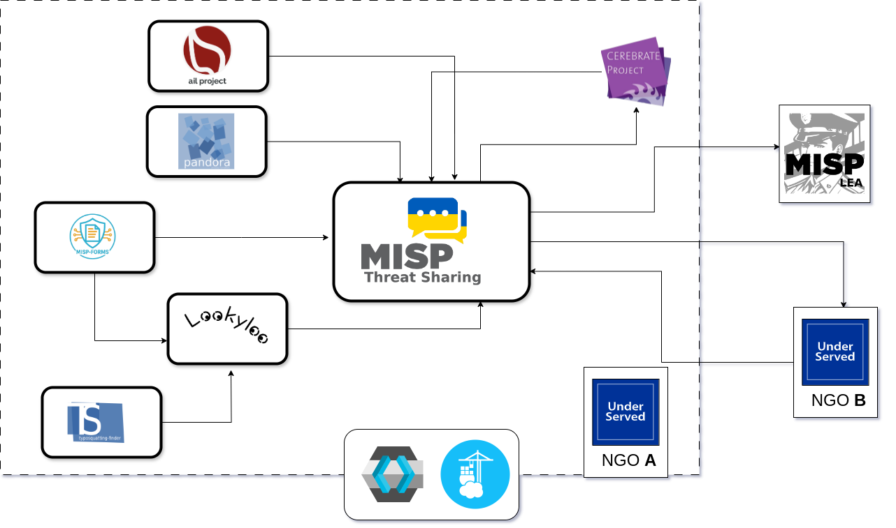

<br>

The UnderServed project aims to provide NGOs with a free, self-hosted cyber threat reporting platform that is easy to install and simple to use. It enables organisations to report cyber incidents and securely share information with other NGOs and law enforcement agencies.

More Information on Project: https://underserved-project.eu/

### Platform Overview

The platform integrates a suite of threat intelligence tools developed by CIRCL (Computer Incident Response Center Luxembourg) to support effective and accessible cyber threat reporting.
At its core is MISP (Malware Information Sharing Platform), a powerful threat intelligence platform designed for sharing, storing, and correlating Indicators of Compromise (IoCs), financial fraud data, vulnerability information, and more. MISP is widely used across organisations to store and exchange cybersecurity data, enabling users to detect and prevent threats targeting ICT infrastructure, organisations, and individuals.
While MISP is a powerful tool, contributing meaningful and structured data to it can be complex. It typically requires experience and training to use effectively. The UnderServed platform simplifies this process by surrounding MISP with a set of integrated detection and analysis services, allowing users to submit reports in a user-friendly and structured way. Additional tools are also included to support both users and administrators of the platform.

- MISP-Forms: Provides a variety of user-friendly web forms for reporting various types of cyber incidents. Automatically converts submissions into structured MISP reports.
- Lookyloo (CIRCL): A web interface that captures a webpage and displays a tree of all domain calls made during the visit. It is particularly useful for analysing suspicious websites.
- Pandora (CIRCL): A service for assessing whether files are suspicious. Offers a preview of large documents and their metadata.
- Typo-Squatting Finder (CIRCL): Identifies potential typo-squatted domains, helping users detect malicious impersonation or phishing attempts.
- AIL Framework (CIRCL): Designed to analyse unstructured data sources, such as paste sites, for potential data leaks and threat indicators.
- Keycloak: An open-source Identity and Access Management (IAM) solution for authentication and authorisation of users and services.
- Portainer: A container management tool that simplifies administration, monitoring, and troubleshooting of the Docker environment.


<p align="center">
<br>
</p>

---

## **Requirements**


To ensure stable performance and reliable operation, the UnderServed platform should be deployed on hardware and software that meets the following minimum specifications:  

Operating System:

- Ubuntu Server 22.04 LTS (New Installation)  
  The UnderServed Platform has been fully tested and validated on Ubuntu Server 22.04 LTS. This is the recommended host operating system for production deployments.

Hardware:

- CPU: 4-core (minimum)
- Memory: 32 GB (minimum), 64 GB (recommended)
- Disk Space: Minimum 500 GB SSD
  (Actual storage requirements depend on the expected volume of incident reports, logs, and retained analysis data.)
  

**⚠️ The Underserved platform includes multiple services for threat reporting, enrichment, and analysis, so adequate compute resources are essential. Attempting to deploy the platform on low-specification hardware (virtual or physical) is discouraged, as it will likely result in failed deployment, degraded performance, or incomplete functionality.**

---
## Deployment Quick Start 

Ensure your server has an a domain name.  This will used to access the platform, e.g. https://underserved.myorg.  

1. Connect to platform host server over SSH and run these commands:
```bash
git clone https://github.com/UCD-CCI/Underserved.git
cd Underserved
bash deploy.sh
```
2. Follow on screen instructions and reboot server when instructed. 
3. Re-connect to platform host server over SSH.
4. Start **tmux** session (optional, but doing so with prevent the script from crashing should you lose your SSH connection to the server during the installation.)
```bash
tmux
```  
5. Use **sudo** to run the script this time

```bash   
cd Underserved
sudo bash deploy.sh  
```

6. Follow on screen instructions and provide these details when requested.  (Deployment time approx. 25–35 minutes).
 	- Domain name:  e.g. underserved.myorg
 	- Organistion Name: e.g. myorg
 	- Email Address: e.g. j.smith@myorg.com	   
7. Take note of login credentials before reboot ⚠️
8. After reboot, connect to server on domainname, e.g. https://underserved.myorg
	- It is safe to bypass seurity warnings on browser.  This issue will be resolved when valid SSL certs are installed. 

---

## Full Deployment Guide

## DNS Configuration

To make the platform accessible, configure your organisation’s DNS records as follows.

### Wildcard Subdomain (Recommended)

A wildcard DNS record allows all subdomains to automatically resolve to the server's IP address.

**DNS Record Example:**
```
underserved.myngo.com            A     <server_ip>
*.underserved.myngo.com          A     <server_ip>
```

**Note:** The asterisk (*) in the wildcard record ensures that any subdomain (e.g., `misp.underserved.myngo.com`) points to the server.

### CNAME Records (Alternative)

If your organisation does not permit wildcard DNS entries, manually configure CNAME records for each service.

**DNS Record Example:**
```
underserved.myngo.com                    A     <server_ip>
misp.underserved.myngo.com              CNAME underserved.myngo.com
misp-forms.underserved.myngo.com        CNAME underserved.myngo.com
cerebrate.underserved.myngo.com         CNAME underserved.myngo.com
decider.underserved.myngo.com           CNAME underserved.myngo.com
pandora.underserved.myngo.com           CNAME underserved.myngo.com
lookyloo.underserved.myngo.com          CNAME underserved.myngo.com
ail.underserved.myngo.com               CNAME underserved.myngo.com
typosquatting.underserved.myngo.com     CNAME underserved.myngo.com
portainer.underserved-jan.myngo.com     CNAME underserved.myngo.com
mkdocs.underserved-jan.myngo.com        CNAME underserved.myngo.com
```

**Note:** Replace `<server_ip>` with the actual public IP address of your server.

### Choosing Between Wildcard and CNAME Records
- **Wildcard DNS** is easier to manage and automatically covers all subdomains.
- **CNAME Records** require manual configuration but are necessary in environments that restrict wildcard use.

Ensure DNS changes have propagated before starting the deployment.

---

## Download and Execute Deployment Script

Clone the Underserved Repository

```bash
git clone https://github.com/UCD-CCI/Underserved.git
cd Underserved
bash deploy.sh
````

1. Follow on Screen instructions
2. Docker Dependency check will fail - This is expected behaviour on a first deployment.
3. The script will prompt you for your password and install docker. 
4. After docker installation completes you will be asked to **reboot**,  again password is required.


### After Reboot
Reconnect to the server:
Start a tmux session - Using tmux will protect your deployment process from crashing if connection to the server is lost
```bash
tmux
```
Re-run these commands - Note, using to sudo this time.  This will ensure you are not asked to submit password multiple times during the install. 
```
cd Underserved
sudo bash deploy.sh
```

### Script Prompts & Configuration

**Python dependencies**
- You will be prompted for you password to install additonal python dependencies

**Overcommit Memory:**
- Choose `y` to enable on the virtual server

**FQDN Configuration:**
- Enter your platform FQDN (e.g., `underserved.myngo.com`)

**Organisation Details:**
- Use a short name without spaces
- Provide a valid administrative email address

**SSL Certificates:**
- Initially, private SSL certificates are used
- You may receive browser warnings (this is expected)
- See Section 2 for setting up valid SSL certificates

The script will now:
- Clone required repositories
- Build Docker images
- Start containers
- Configure service integration

This may take 25–50 minutes and runs unattended.

---

## Installation Complete

When finished, you will be presented with the platform URL and login credentials. **Be sure to save this information.**

You will be prompted to reboot:
- Type `Y`
- Enter the server password

After reboot, access the platform at the provided URL.

**Note:** Because private SSL certificates are used during initial deployment, your browser may display a warning. It is safe to proceed.

---

## Let's Encrypt SSL Script (Optional)

During deployment private SSL certs are generated.  These can be replaced by certificates provided by your organisation or you can generate certificates using Let's Encrypt.
Let's Encrypt is a free, automated, and open Certificate Authority (CA) provided by the Internet Security Research Group (ISRG). The platform includes a script to automate the generation of SSL certificates.

### Running the Script
1. Connect to the platform host via SSH (see Section 3.1).
2. Run the following commands:
```bash
tmux
cd underserved
bash lets_encrypt_ssl_generate.sh
```

The script will prompt for certificate details.

## Sync with Remote MISP Server

This guide explains how to synchronise events between two MISP instances. You can either pull data from a remote MISP server or push data to it. 
Syncing allows threat intelligence sharing across organisations. This is a guide for syncing MISP server A with MISP Server B

---

### MISP Server A
Login to **MISP Server A** with admin account

Create a Sync User on the MISP A

1. Go to **Administration > Add User**.
    
2. Click **Add Sync User**.
    
3. Fill in the details:
    
    - Email: something like `sync@yourorg.local`
    - Set password:       
    - Role: choose a **sync user**
    - Uncheck all boxes below 

4. Choose **Create User**

5. Log out of MISP server 

6. Login with new sync account
7.  Go to **Sync Actions** > Create Sync config
8.  Make a copy of the json output


### MISP Server B  

Login to **MISP Server B** with admin account

1. Go to **Sync Actions** > **Remote Servers**.
    
2. Click **Import**.
    If import not listed in menu on right, simple add /import to the end of the current address, e.g. https://misp.myorg.com/servers/import
    
3. Paste json file created on MISP Server A
		- Enabled synchronisation methods - check push and pull
		- Allow self signed certificates (unsecure)

4. Click **Submit**.

---

### Utilities Script

To support admin basic functions. like password resets, a utility script is provided.

To run, ssh into the platform servers and

```bash
cd underserved
bash utils.sh
```
Utils Menu
Choose option from menu.

```shell
===============================================
 UnderServed Manager Utility
===============================================
1. Restart all UnderServed Docker containers
2. Stop all UnderServed Docker containers
3. Reboot the server
4. Get Platform Admin Username & Password
5. Reset Portainer Password
6. Reset AIL-Framework Password
7. Exit
===============================================


```

---

### Acknowledgements

This project was made possible thanks to the tools provided by the following organisations and open-source communities:

- [CIRCL (Computer Incident Response Center Luxembourg)](https://www.circl.lu/)
	- [MISP (Malware Information Sharing Platform)](https://www.misp-project.org/)
	- [Lookyloo](https://www.lookyloo.eu/)
	- [Pandora](https://github.com/pandora-analysis/pandora)
	- [TypoSquatting-Finder](https://github.com/typosquatter/ail-typo-website)
	- [Cerebrate](https://github.com/cerebrate-project/cerebrate)
  	- [AIL-Framework](https://www.ail-project.org/)
   
- [Portainer CE](https://www.portainer.io/)  
- [MKDocs](https://www.mkdocs.org/)  
- [Homepage by gethomepage.dev](https://gethomepage.dev/)  
- [Decider by CISA](https://github.com/cisagov/decider)
- [Keycloak](https://www.keycloak.org/)


