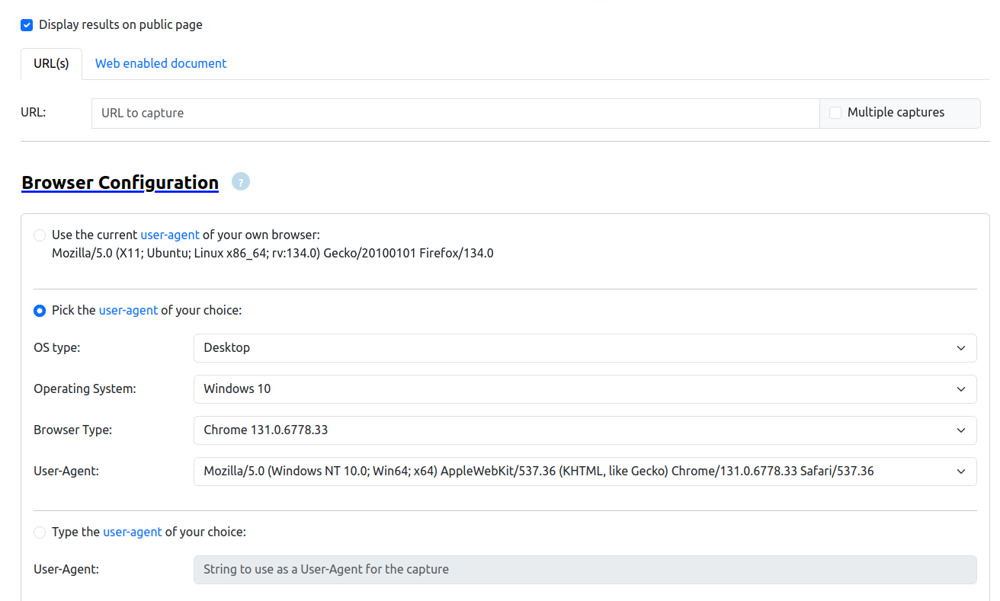
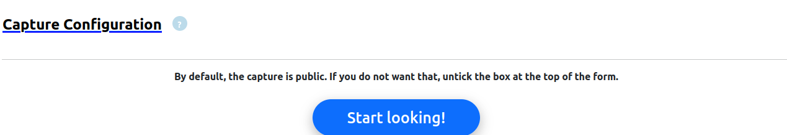
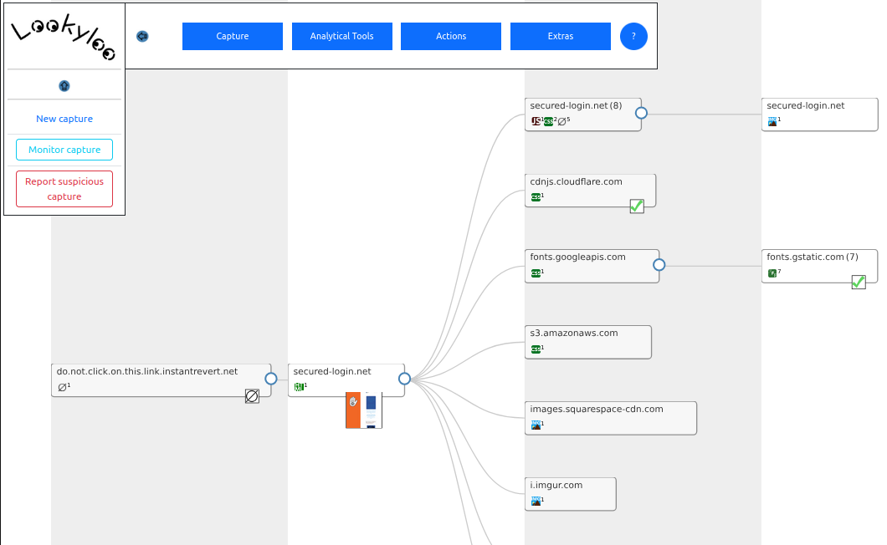

# Lookyloo  

{ align=right width=180 }

Lookyloo is a web-based analysis tool that captures the full behavior of a webpage, mapping its domain interactions in a tree-like structure.  
It is particularly useful for investigating suspicious websites in a safe, controlled environment.  

---

#### Safely Analyse Websites with Lookyloo  

If you come across a suspicious website - whether from an email, SMS message, another website, or even physical correspondence—Lookyloo allows you to inspect and analyze it safely without exposing your device to risk.  

After processing, Lookyloo generates a visual map of the website’s structure. Even if this data is not immediately useful to you, it plays a key role in preparing submissions to MISP ensuring that all key metadata and relevant indicators are shared with analysts and investigators, strengthening cyber threat intelligence efforts.

---

### How to Use Lookyloo  

#### 1) Capture a Website  

To analyze a website using Lookyloo, follow these steps:  

1. Open Lookyloo from your platform.  
2. Select "Submit a New Capture."  
3. Keep the default settings under Browser Configuration and Capture Configuration.  
4. Scroll down and click "Start Looking."  

  
  

#### Processing Time  
The analysis process may take several minutes, depending on the website's size and complexity. Once complete, a visual map of the website's structure will be displayed.  

  

---

#### 2) Perform Additional Analysis *(Optional)*  

- Navigate to Analytical Tools > Third-Party Tools.  
- Use external services like VirusTotal and urlscan.io to further analyze the website for potential threats.  

---

#### 3) Submit Findings to MISP  

- Go to Actions > Prepare to Push to MISP > Push to MISP.  
This ensures that all relevant metadata and website details are properly shared with MISP, aiding further analysis by security professionals.  

---

For more advanced usage, refer to the [CIRCL User Guide](https://www.lookyloo.eu/docs/main/index.html){:target="_blank"}
