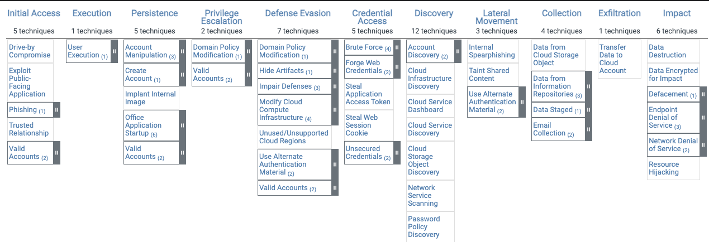

### Understanding MITRE ATT&CK®

MITRE ATT&CK® stands for MITRE Adversarial Tactics, Techniques, and Common Knowledge (ATT&CK). The [MITRE ATT&CK framework](https://attack.mitre.org/) is a globally recognized knowledge base that catalogs cyber adversary behaviors, detailing the various phases of an attack lifecycle and the platforms they target. This structured approach provides a standardized taxonomy for understanding cyber threats, aiding cybersecurity professionals in both offensive and defensive security operations.

#### Core Components of MITRE ATT&CK
The ATT&CK framework consists of three primary components that form the foundation of adversary behavior classification:

- Tactics: The overarching objectives of an attack, representing the "why" behind an adversary’s actions (e.g., initial access, persistence, exfiltration).
- Techniques: The specific methods adversaries use to accomplish tactical goals, representing the "how" of an attack.
- Procedures: Detailed descriptions of how threat actors implement specific techniques in real-world scenarios.

These components provide security analysts with actionable intelligence to detect, mitigate, and prevent cyber threats more effectively. [[1]](https://www.mitre.org/sites/default/files/publications/pr-18-0944-11-mitre-attack-design-and-philosophy.pdf)

#### History and Evolution of MITRE ATT&CK
The MITRE ATT&CK framework was conceived in 2013 as part of MITRE’s Fort Meade Experiment (FMX), where researchers emulated real-world adversaries to assess the effectiveness of defensive cybersecurity measures. The objective was to answer the critical question: *"How well are we detecting and responding to adversary behavior?"* 

Through systematic categorization and behavioral analysis, MITRE ATT&CK evolved into a widely adopted framework used by threat intelligence analysts, incident responders, and security operations teams globally.

#### MITRE ATT&CK Matrices and Domains
The ATT&CK framework is structured into different matrices that categorize tactics and techniques specific to different domains:

##### 1. Enterprise ATT&CK
- Covers adversary behavior targeting enterprise IT systems, including Windows, macOS, Linux, and cloud environments.
- Techniques include credential dumping, lateral movement, and privilege escalation.

##### 2. Mobile ATT&CK
- Focuses on attacks against mobile devices, such as iOS and Android platforms.
- Includes techniques like malicious app deployment and exploitation of insecure communication channels.

##### 3. ICS ATT&CK
- Addresses threats against Industrial Control Systems (ICS) used in critical infrastructure sectors.
- Covers attack techniques used to manipulate control processes and disrupt operations.

For detailed matrices, refer to the official MITRE ATT&CK website: [MITRE ATT&CK Matrices](https://attack.mitre.org/matrices/enterprise/)

#### Using MITRE ATT&CK in Cybersecurity
Security professionals leverage ATT&CK in multiple areas, including:

- Threat Intelligence & Attribution: Mapping known adversary behaviors to understand attacker motives and methodologies.
- Red Teaming & Simulated Attacks: Conducting adversary emulation exercises to improve security resilience.
- Blue Teaming & Incident Response: Enhancing detection and response mechanisms by aligning security operations with ATT&CK techniques.
- Threat Hunting: Proactively identifying and mitigating cyber threats before they cause harm.

Organizations like [CISA](https://www.cisa.gov/), [NIST](https://www.nist.gov/), and private sector firms integrate MITRE ATT&CK into their security frameworks to bolster defenses.

#### MITRE ATT&CK Tools and Resources
Security teams can utilize a variety of tools that integrate with ATT&CK to enhance threat intelligence and detection:

- [MITRE ATT&CK Navigator](https://attack.mitre.org/resources/enterprise-matrix/): A visualization tool to explore ATT&CK techniques and map detections.
- [ATT&CK for Security Operations Center (SOC)](https://attack.mitre.org/resources/): Best practices for incorporating ATT&CK into SOC workflows.
- [CALDERA](https://caldera.mitre.org/): An automated adversary emulation platform for cybersecurity testing.

#### Conclusion
MITRE ATT&CK serves as a cornerstone for understanding and mitigating cyber threats, providing a universal language for adversary behavior. By integrating ATT&CK into cybersecurity operations, organizations can enhance threat detection, response capabilities, and overall cyber resilience. 

To stay updated, visit the official MITRE ATT&CK website: [MITRE ATT&CK Home](https://attack.mitre.org/).
