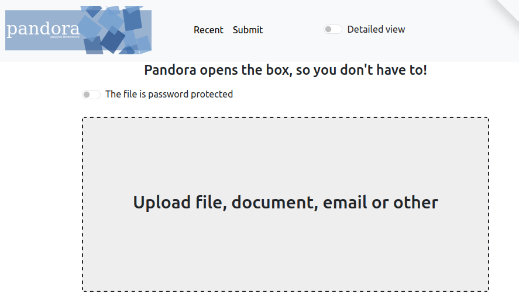
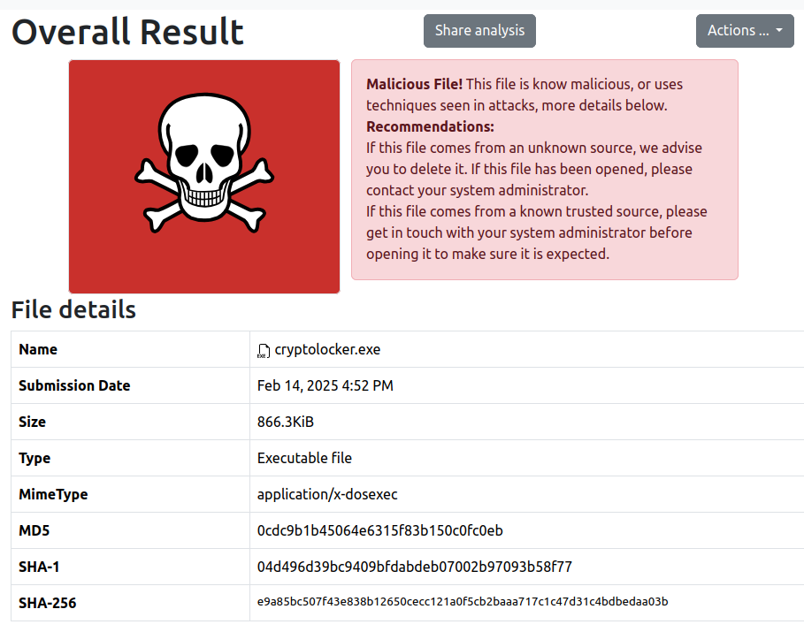

# Pandora  

{ align=right width=150 }
Pandora is an analysis framework designed to determine if a file is suspicious, conveniently displaying the results. It provides a user-friendly content preview interface for large documents, including metadata insights. This allows users to view files safely without needing to open them locally.

---

#### Safely Analyse Files with Pandora  

You can securely analyze files, including documents and executable programs, using the Pandora service. This enables a thorough security assessment without putting your device at risk.  

The analysis process is generally quick but may vary depending on the file size. If the file is deemed dangerous or suspicious, Pandora will provide a clear warning message to alert you.  

---

### How to Use Pandora  

#### 1) Upload the File  
- Drag and drop the file into the "Select File" box, or  
- Click "Select File" and browse to the file’s location.  

  

#### 2) Review the Analysis Results  
Once the file is processed, Pandora will present its findings.  

  

#### 3) Submit Findings to MISP  
- Navigate to Actions > Submit to MISP  
This ensures that relevant threat intelligence is shared with investigators and analysts via MISP.  

---

For more advanced usage, refer to the [CIRCL User Guide](https://circl.lu/services/pandora-document-analysis/){:target="_blank"}
