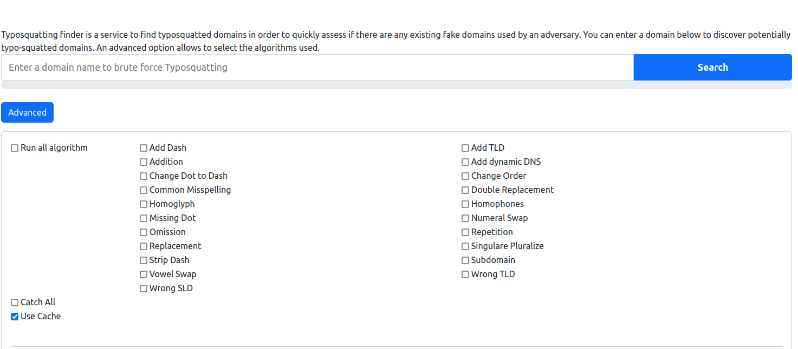
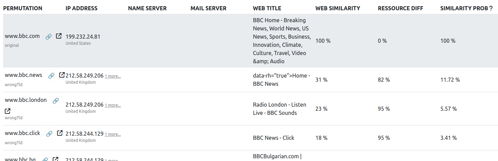

Typo-Squatting:

{ align=right width=150 }

Find typosquatted domains in order to quickly assess if there are any existing fake domains used by an adversary. You can enter a domain below to discover potentially typo-squatted domains. An advanced option allows to select the algorithms used.

---

#### Detecting Typo-Squatting on Your Organization's Domain

This tool offers a straightforward method for identifying potential typo-squatting on your organisation's domain. It can be used in conjunction with Lookyloo to further investigate suspicious domains.

If you discover a domain that appears to be impersonating your organization, you can safely analyse it using Lookyloo and report it accordingly. This ensures that relevant information is captured and shared for further investigation.

---

#### How to Use Typo-Squatting Finder

To identify potential typo-squatting on your organization's domain, follow these steps:  

1. Enter Your Domain  
   - Type your domain name into the search box.  
   - Click "Advanced" to access additional configuration options.  

2. Configure Search Parameters  
   - You will be presented with a set of checkboxes to control how the tool generates potential typo-squatting variations of your domain.  
   - Selecting "Run All Algorithms" may produce a large number of false positives, especially for short domain names, such as acronyms (e.g., [bbc.com](https://www.bbc.com/)).  
   - For an initial search, start with "Add TLD" and "Wrong TLD" to generate variations like:  
     - `https://www.bbc.net`  
     - `https://www.bbc.com.io`  

3. Run the Search  
   - Once you have selected the desired algorithms, click "Search."  

4. Review the Results  
   - The tool will generate a list of potential typo-squatting domains, check whether they are active, and compare their content to the official website.  
   - The results update automatically, but the process may take 10-15 minutes to complete.  

5. Focus on High-Risk Domains  
   - Pay attention to domains with **high similarity probability** percentages, as they are more likely to be malicious or deceptive.  

#### Further Investigation with Lookyloo:  

   - Copy the identified domain and paste it into Lookyloo for analysis.  
   - Lookyloo will generate a screenshot of the homepage, helping determine whether the site is engaging in typo-squatting.  

Report to MISP  

   - If a suspicious domain is confirmed, submit the details to MISP for further investigation and intelligence sharing

---

