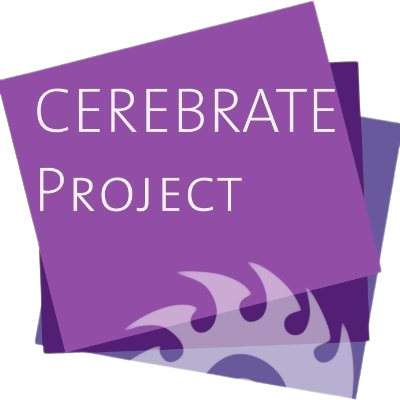
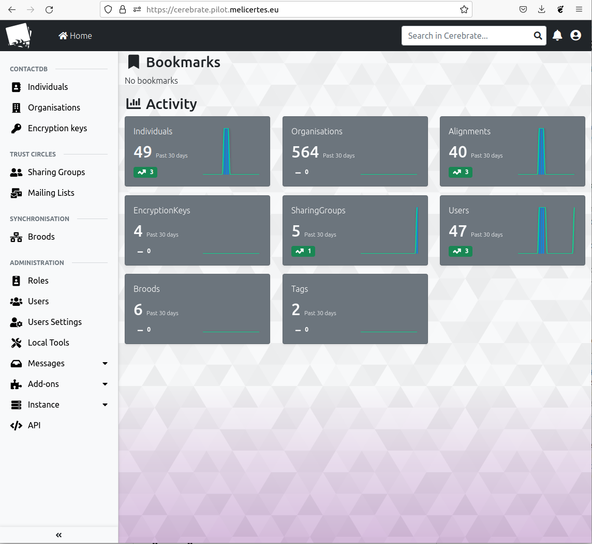
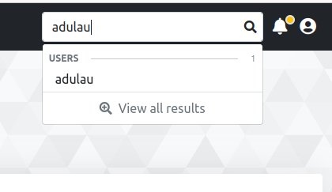

Cerebrate:  

{ align=right width=150 }

An open-source platform designed to act as a trusted contact information provider and interconnection orchestrator for other security tools. 

---

Main page and navigation

When login in Cerebrate, the user get a main page with some activity statistics. Depending of the role and permissions of the user, there are different items on the left menu such as:

- ContactDB management
- Trust Circles
- Synchronisation
- Administration

---
Global search

A global search is available in Cerebrate. This search allows to search in all the different elements and easily find a specific user, organisations, sharing groups.

---
[More Information](https://doc.cerebrate-project.org/){:target="_blank"}

---