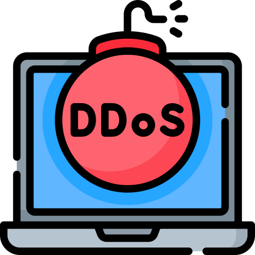

{ align=right width=150 }

A Denial of Service (DoS) attack is a cyber attack that aims to make a website, service, or system unavailable by overwhelming it with excessive traffic. This prevents legitimate users from accessing the service.

---

#### How Does a DoS Attack Work?
- Attackers send a massive number of requests to a website or online service.
- The system becomes overloaded and either stops working or slows down significantly.
- This prevents real users from accessing the website or system.

A DoS attack typically originates from a single computer or internet connection.

---

#### What is a Distributed Denial of Service (DDoS) Attack?
A Distributed Denial of Service (DDoS) attack is a larger, more powerful version of a DoS attack. Instead of using one computer, attackers use multiple devices (often globally distributed) to launch the attack simultaneously.

#### How Does a DDoS Attack Work?
- Attackers infect thousands (or millions) of computers, routers, or IoT devices with malware.
- These infected devices (called a botnet) are controlled remotely.
- The botnet sends massive amounts of fake traffic to the target.
- The target website or service crashes or slows down significantly.

#### Key Differences Between DoS and DDoS
| DoS Attack | DDoS Attack |
|---------------|---------------|
| Uses one computer or connection. | Uses many computers across different locations. |
| Easier to block. | Harder to block because traffic comes from different sources. |
| Slows down or crashes a service. | Can completely take down large services or organizations. |

---

### Why Are Organizations Targeted?
Organizations can be targeted for multiple reasons, including:
- Political or ideological reasons – Hacktivists may attack organizations supporting certain causes.
- Financial extortion – Attackers may demand ransom payments to stop the attack.
- Disruption of services – Competitors or cybercriminals may attempt to take down critical services.

---

### How to Protect Against DoS and DDoS Attacks
Even with minimal cybersecurity knowledge, organizations can take simple steps to reduce the risk of an attack:

✅ Use a Content Delivery Network (CDN) – Services like Cloudflare, Akamai, or AWS Shield help filter out malicious traffic.  
✅ Enable DDoS protection – Many hosting providers offer built-in protection—contact your IT team or hosting provider for details.  
✅ Monitor your website traffic – Look for sudden spikes in visitors, which could indicate an attack.  
✅ Limit access to critical systems – Use firewalls to block unusual or suspicious traffic.  
✅ Have an emergency response plan – Know what steps to take if your organization's website or systems go offline due to an attack.  

---

### Signs That You Are Experiencing a DoS/DDoS Attack

#### 1. Website or Online Services Become Slow or Unresponsive
- Pages take too long to load or fail to load.
- Forms, payment portals, or logins do not function properly.

#### 2. Unusual Traffic Spikes from Unknown Sources
- A sudden and massive increase in visitors from unusual locations.
- Traffic coming from one country or region where you don’t normally have users.
- Many requests targeting a single page, such as login or donation pages.

#### 3. Website or Server Crashes Repeatedly
- The system restarts or becomes completely unavailable.
- You receive alerts from your hosting provider about excessive resource usage.

#### 4. Unusual Activity in Server or Network Logs
- A large number of requests from the same IP address (in a DoS attack).
- Thousands or millions of requests from different IPs worldwide (in a DDoS attack).
- Requests targeting a single webpage or service repeatedly.

#### 5. High Bandwidth or CPU Usage
- Your server, router, or firewall shows extreme network traffic.
- CPU and memory usage spike to 100%.
- Your internet connection slows down significantly.

---

### How to Confirm a DoS/DDoS Attack
If you notice the above signs, follow these steps to confirm whether your organization is under attack:

#### Step 1: Check Your Website Status
- Try loading your site from different devices and internet connections.
- Ask staff or partners in different locations if they experience the same issue.
- Use online tools like:
  - [DownForEveryoneOrJustMe](https://downforeveryoneorjustme.com/) to check global availability.

#### Step 2: Check Traffic in Web Analytics
- Log into Google Analytics, Cloudflare, or your hosting provider’s analytics.
- Look for traffic spikes from unusual countries or IPs.

#### Step 3: Review Server and Network Logs
- If you have access to server logs, look for:
  - A large number of repeated requests from the same IP.
  - Requests targeting a single webpage or service repeatedly.
  - Run the following Linux command to check for high network connections:
    ```bash
    netstat -an | grep :80 | wc -l
    ```

#### Step 4: Check Bandwidth and Resource Usage
- Log into your hosting provider’s dashboard and check:
  - CPU and memory usage.
  - Bandwidth usage—a sudden increase could mean an attack.

#### Step 5: Ask Your Hosting Provider or IT Support
- Many hosting providers detect and report DDoS attacks automatically.
- Contact your web host or IT team to check for alerts or blacklisted IPs.

---

### What to Do If You Confirm a DoS/DDoS Attack
If you confirm that your organization is under attack, take these immediate steps:

✅ Enable DDoS Protection – Activate "Under Attack" mode if using Cloudflare, Akamai, AWS Shield, or similar services.  
✅ Block Malicious IPs – Use your server’s firewall to block suspicious traffic.  
✅ Rate-Limit Requests – Restrict the number of requests an IP can send per second.  
✅ Inform Stakeholders – Let staff, partners, and users know about the issue.  
✅ Contact Your Hosting Provider – They may provide emergency DDoS mitigation services.  

By following these steps, you can minimize downtime and protect your organization's digital assets from DoS and DDoS attacks.
