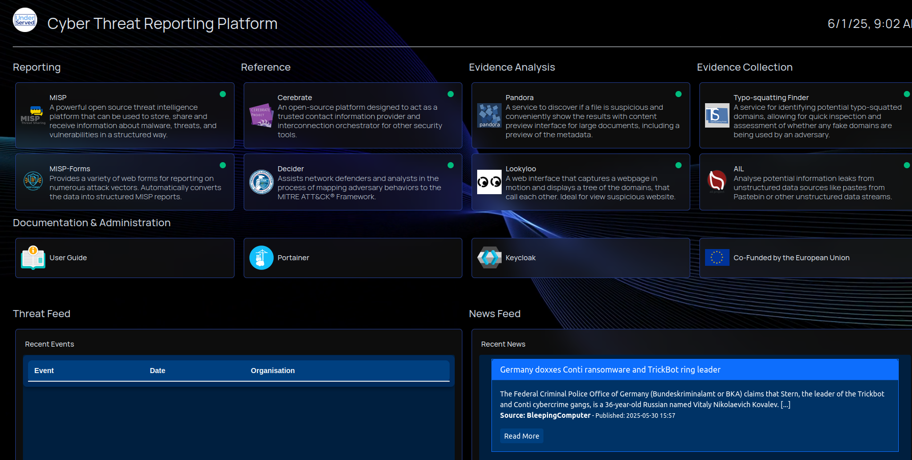

# About the Underserved Platform

The Underserved Platform is designed to provide a streamlined and user-friendly way to report cyberattacks. It offers a comprehensive set of tools and services to ensure that reports contain the necessary details for effective action by law enforcement and other relevant authorities.

A common challenge in cyberattack reporting is the lack of critical details, which can hinder investigations and response efforts. The Underserved Platform addresses this issue by guiding users through a structured reporting process to enhance the quality and usefulness of submitted reports.

This guide will walk you through the platform’s features, how to use them effectively, and best practices for maximising their impact.

  

    
    
      MISP, Cerebrate, Lookyloo, Pandora, Typo-Squatting Finder developed by The Computer Incident Response Center Luxembourg 
      <a href="https://www.circl.lu/">CIRCL</a>
    
  

---
