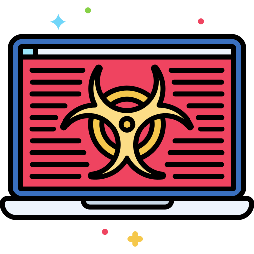

{ align=right width=150 }

Malware (short for malicious software) is any software designed to harm, steal, or disrupt a computer, network, or device. Hackers use malware to steal personal information, spy on users, damage files, or even take control of entire systems. Malware comes in different forms, like viruses, ransomware, spyware, and trojans, each with its own way of causing trouble. 

---

Malware infections can compromise data, disrupt operations, and damage system integrity. Follow these steps to recover from a malware incident:

#### **Step 1: Isolate the Infected System**
- Disconnect the infected system from the network to prevent the malware from spreading.
- Avoid shutting down the system, as it may erase evidence or enable the malware’s persistence mechanisms.

#### **Step 2: Identify the Malware**
- Use antivirus or anti-malware tools to scan the system and identify the type of malware.
- Review system logs and alerts to determine the infection vector.

#### **Step 3: Contain the Infection**
- Quarantine the infected files or applications using security software.
- Block malicious IP addresses and domains identified in the attack.

#### **Step 4: Remove the Malware**
- Use trusted malware removal tools or follow manual removal instructions provided by security vendors.
- Remove all suspicious software, scripts, or files from the system.

#### **Step 5: Restore from Backup**
- If malware removal is not possible or reliable, restore the system from a clean, recent backup.
- Ensure the backup is malware-free before deployment.

#### **Step 6: Update Security Measures**
- Install the latest security patches and updates for your operating system and applications.
- Update antivirus and anti-malware definitions to protect against similar threats.

#### **Step 7: Notify Relevant Parties**
- Inform your IT or security team about the incident.
- Notify affected users, customers, or stakeholders if sensitive data has been exposed.

#### **Step 8: Conduct a Post-Incident Review**
- Analyse the attack to determine how the malware entered the system.
- Document lessons learned and update security policies to address gaps.

---

### Mitigate the Risk of Malware Infections

Preventing malware infections requires a proactive approach to security. Follow these best practices:

#### **Keep Software Updated**
- Regularly update operating systems, applications, and plugins to patch vulnerabilities.
- Enable automatic updates wherever possible.

#### **Use Robust Security Software**
- Install reputable antivirus and anti-malware tools on all systems.
- Enable real-time scanning and automatic updates for threat definitions.

#### **Educate Employees and Users**
- Conduct regular training on recognising phishing emails, malicious links, and suspicious downloads.
- Promote awareness of safe browsing practices and secure software usage.

#### **Restrict User Privileges**
- Implement the principle of least privilege (PoLP) to limit user access to only necessary resources.
- Use separate accounts for administrative and regular tasks.

#### **Implement Network Security Measures**
- Deploy firewalls, intrusion detection systems (IDS), and intrusion prevention systems (IPS) to monitor and block threats.
- Segment networks to contain potential infections.

#### **Enable Email Security**
- Use email filtering tools to block spam and phishing attempts.
- Warn users about potentially unsafe attachments or links.

#### **Backup Data Regularly**
- Create frequent backups of critical data and store them securely offline.
- Test backup restoration processes periodically to ensure reliability.

#### **Monitor and Respond to Threats**
- Use security information and event management (SIEM) tools to detect and respond to anomalies.
- Set up alerts for unusual activity, such as large data transfers or unauthorised access attempts.

#### **Develop an Incident Response Plan**
- Establish a clear plan for responding to malware incidents, including roles, responsibilities, and escalation procedures.
- Conduct regular drills to ensure readiness for potential threats.

By implementing these measures, you can reduce the risk of malware infections and minimise the impact of potential attacks on your systems and data.
