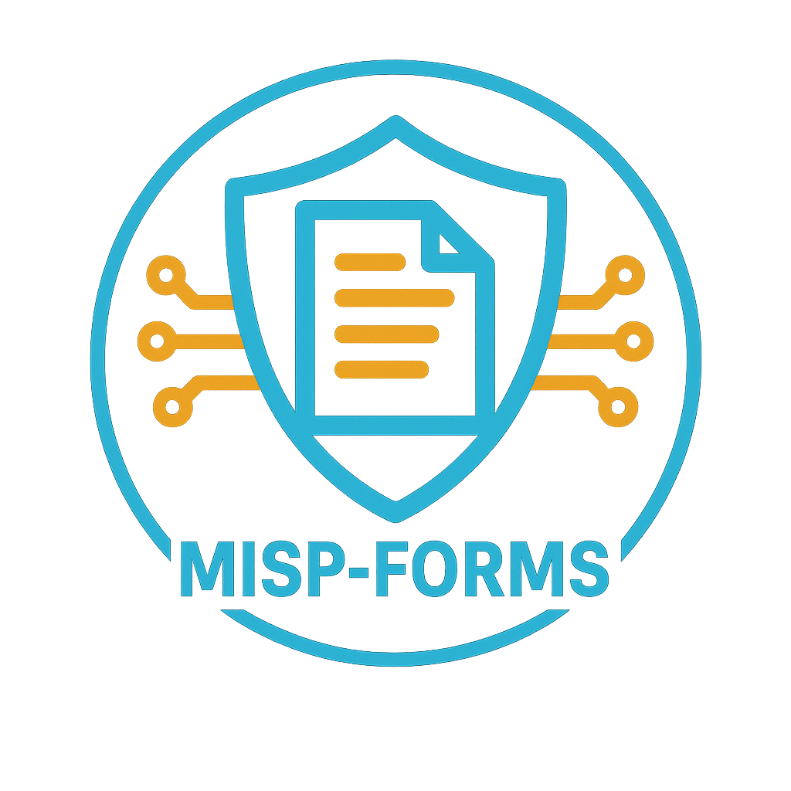
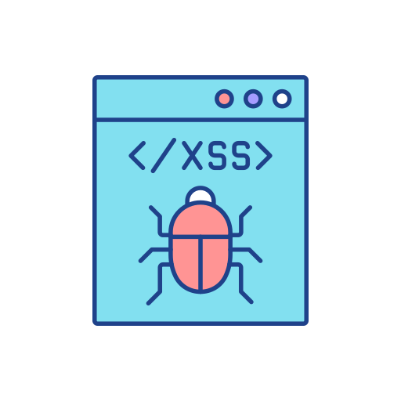

MISP-Forms: Streamlined Cyber Attack Reporting 

{ align=right width=140 }

MISP-Forms is a service designed to provide users with a set of intuitive forms for reporting various types of cyberattacks. 
These forms ensure that all relevant data is accurately captured and structured in a format that makes it actionable for law enforcement agencies, 
national authorities, and organizations such as CSIRTs (Computer Security Incident Response Teams).  Below is a brief description of each form.

---

### Phishing

{ align=right width=75 }

A phishing email is a deceptive message sent by attackers to trick recipients into revealing sensitive information, 
such as login credentials, credit card numbers, or personal data.

[[More Information]](phishing.md)
[[Report Incident]](https://misp-forms.underserved.org/phishing_choice)

---

### Website Defacement

{ align=right width=75 }

An attack where an intruder gains unauthorized access to a website and alters its appearance or content. 
Typically, attackers replace the site's content with their own messages, often to display political or 
social statements, spread misinformation, or damage the site's reputation.

[[More Information]](Website%20Defacement.md)
[[Report Incident]](https://misp-forms.underserved.org/web_defacement)

---

### Smishing

{ align=right width=75 }

Smishing is a type of phishing attack carried out through SMS (text messages). It involves cybercriminals
sending fraudulent messages to trick recipients into revealing sensitive information, such as login credentials, 
financial details, or personal data. 

[[More Information]](smishing.md)
[[Report Incident]](https://misp-forms.underserved.org/smishing)

---

### Denial-of-Service (DoS/DDoS)
{ align=right width=75 }

A malicious attempt to disrupt the normal functioning of a targeted server, service, or network by overwhelming it 
with a flood of illegitimate requests.

[[More Information]](ddos.md)
[[Report Incident]](https://misp-forms.underserved.org/ddos)

---

### Cross-Site Scripting (XSS)

{ align=right width=75 }

 This attack occurs when an attacker injects malicious scripts into trusted websites or applications, targeting unsuspecting 
 users. Social XSS involves leveraging social engineering tactics to trick victims into interacting with malicious links 
 or payloads.
 
[[More Information]](xss.md)
[[Report Incident]](ttps://misp-forms.underserved.org/xss)
 ---

### Quishing - Scam QR Code

{ align=right width=75 }

A type of phishing attack that uses QR codes to trick victims into revealing sensitive information or downloading malicious 
content. In these attacks, cybercriminals generate a QR code that, when scanned, redirects the victim to a fraudulent website 
designed to steal credentials, personal information, or payment details. 

 [[More Information]](quishing.md)
[[Report Incident]](https://misp-forms.underserved.org/quishing)

---

### Typo-Squatting

{ align=right width=75 }

 A type of online scam where attackers create fake websites with names that are very similar to real, trusted websites, 
 often by using common typing mistakes. For example, if the real website is "example.com", they might create "exmaple.com" 
 or "examplle.com". When people accidentally visit these fake sites, they might be tricked into sharing personal information, 
 downloading harmful software, or even making payments. 
 
 [[More Information]](typo-squatting.md)
[[Report Incident]](https://misp-forms.underserved.org/typo-squatting)

---

### Invoice Diversion Fraud

{ align=right width=75 }

Also known as Mandate Fraud or Business Email Compromise, this is a type of financial fraud where a scammer impersonates 
a legitimate supplier, vendor, or business partner and tricks the victim into redirecting payments to a fraudulent bank account.

 [[More Information]](invoice_fraud.md)
[[Report Incident]](https://misp-forms.underserved.org/invoice_diversion)

---

### Scam or Suspicious Website

{ align=right width=75 }

a fake site designed to trick people into sharing personal information, such as passwords, credit card numbers, 
or other sensitive data, or to steal money by pretending to offer products, services, or opportunities. 

 [[More Information]](typo-squatting.md)
[[Report Incident]](https://misp-forms.underserved.org/typo-squatting)

---

### SQL Injection Attack

{ align=right width=75 }

A type of cyberattack where a hacker tricks a website into giving them unauthorized access to its database. They do this  by entering special commands (instead of normal input) into a login form or search bar. If the website isn’t properly 
secured, it mistakenly runs those commands, allowing the hacker to steal, change, or even delete important data—like  passwords, credit card details, or private messages.

 [[More Information]](sql-injection.md)
[[Report Incident]](https://misp-forms.underserved.org/sql_injection)

---

### Malware Infection

{ align=right width=75 }

Any software designed to harm, steal, or disrupt a computer, network, or device. Hackers use malware to steal personal 
information, spy on users, damage files, or even take control of entire systems. 

[[More Information]](malware.md)
[[Report Incident]](https://misp-forms.underserved.org/malware)

---

### Ransomware

{ align=right width=75 }

A type of malicious software that encrypts files on a computer or network, making them inaccessible to the user. The 
attacker then demands a ransom—usually in cryptocurrency—in exchange for a decryption key. 

[[More Information]](ransomware.md)
[[Report Incident]](https://misp-forms.underserved.org/ransomware)

---

### Disinformation

{ align=right width=75 }

the deliberate spread of false or misleading information with the intent to deceive, manipulate public perception, or 
influence behavior. Unlike misinformation, which is false information shared without harmful intent, disinformation is 
intentionally crafted and distributed to achieve specific objectives, such as political influence, social division, 
or economic gain.

[[More Information]](disinformation.md)
[[Report Incident]](https://misp-forms.underserved.org/disinformation)

---

### Man-in-the-Middle

{ align=right width=75 }

An attack that occurs when an attacker secretly intercepts and possibly alters communication between two parties without them 
knowing. This allows the attacker to steal sensitive data, such as login credentials, financial information, or personal
messages. 

[[More Information]](mitm.md)
[[Report Incident]](https://misp-forms.underserved.org/mitm)

---

### Social Engineering

{ align=right width=75 }

 a type of cyberattack that relies on psychological manipulation rather than technical hacking. Instead of breaking into 
 systems, attackers trick people into giving up confidential information, such as passwords, financial details, or access 
 to sensitive systems.

[[More Information]](soc_eng.md)
[[Report Incident]](https://misp-forms.underserved.org/social_eng)

---

### Vishing (Voice Phishing)

{ align=right width=75 }

 A type of fraud where attackers use phone calls to manipulate victims into revealing sensitive information, such as login 
 credentials or financial details. Attackers often impersonate trusted entities, such as banks, government agencies, or tech 
 support, to create a sense of urgency and pressure victims into compliance. 
 
[[More Information]](vishing.md)
[[Report Incident]](https://misp-forms.underserved.org/vishing)

---

### Password Attack

{ align=right width=75 }

A type of cyber attack where an attacker tries to gain unauthorized access to a system, account, or network by cracking or 
stealing passwords. Since passwords are often the weakest link in security, attackers use various methods to guess, steal, or bypass them. 

[[More Information]](password_attack.md)
[[Report Incident]](https://misp-forms.underserved.org/password_attack)

---

### Custom Report

{ align=right width=75 }

This form allows you to build a custom event consisting of selected attributes. You can select a category, choose an attribute 
type, and enter a value. You may add multiple attributes. 

[[Report Incident]](https://misp-forms.underserved.org/dynamic_form)

---