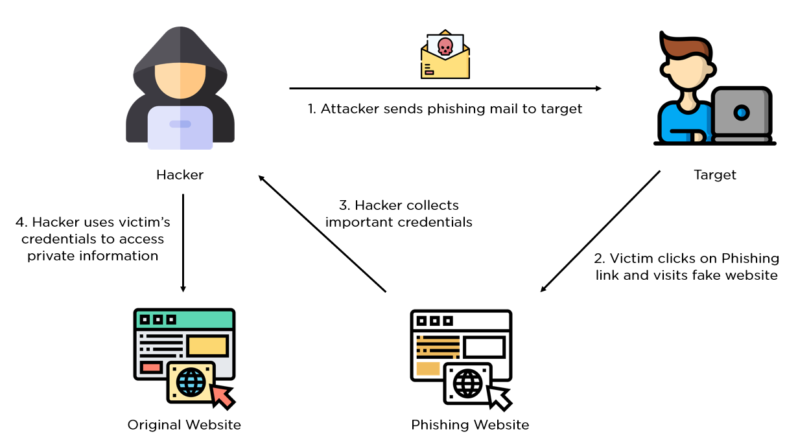

{ align=right width=100 }

A phishing email is a deceptive message sent by attackers to trick recipients into revealing sensitive information, such as login credentials, credit card numbers, or personal data. These emails often appear to be from trusted sources, like banks, well-known companies, or government agencies, and may include urgent language to pressure recipients into taking immediate action. Phishing emails typically contain links to fake websites that mimic legitimate ones or include malicious attachments. Once the user interacts with these links or downloads the attachments, attackers can steal information, install malware, or gain unauthorized access to the user's accounts. The goal is to exploit human trust and curiosity to compromise security. 

---

### Types of Phishing

####Email Phishing  
Attackers send fraudulent emails pretending to be from reputable sources to steal sensitive information or spread malware.

####Spear Phishing  
A targeted form of phishing that customizes messages to individuals or organizations using gathered personal information.

####Whaling  
Targets high-profile individuals like executives or board members, often using legal or business-related pretexts.

####Smishing (SMS Phishing)  
Fraudulent SMS messages trick users into clicking malicious links or sharing information.

####Vishing (Voice Phishing)  
Attackers impersonate trusted entities over the phone to obtain sensitive data.

####Clone Phishing  
Legitimate emails are duplicated with malicious attachments or links, appearing as follow-ups or updates.

####Pharming  
Users are unknowingly redirected from legitimate websites to fraudulent ones via DNS manipulation or malware.

####Angler Phishing  
Targets social media users through fake accounts or hijacked profiles, posing as customer service representatives.

####Man-in-the-Middle (MITM) Phishing  
Attackers intercept online communications to steal credentials, often through unsecured Wi-Fi networks.

####Malware-Based Phishing  
Emails or messages deliver malware via attachments or links, compromising the victim’s device.

---

### How to Identify Phishing Emails

1. Check the Sender's Email Address – Attackers use addresses resembling legitimate ones (e.g., `support@paypaI.com` instead of `support@paypal.com`).
2. Look for Generic Greetings – Phishing emails use vague greetings like “Dear Customer” instead of your name.
3. Hover Over Links – Without clicking, check the actual URL to see if it matches the company’s official website.
4. Watch for Urgent Language – Phrases like “Immediate action required” pressure users into acting quickly.
5. Check for Spelling and Grammar Errors – Poorly written emails often indicate phishing.
6. Avoid Downloading Unexpected Attachments – Phishing emails may carry malware-infected attachments.
7. Beware of Unusual Requests – Companies rarely request sensitive information over email.
8. Check for Unusual Redirections – Be cautious if asked to update account info via an unfamiliar site.
9. Be Skeptical of High-Value Promises – Offers of large rewards or lottery winnings are often scams.
10. Look for Poor Logo Quality or Inconsistent Branding – Fake emails may have blurry logos and unprofessional formatting.
11. Examine the Reply-To Address – It may differ from the "From" address in phishing attempts.
12. Verify with the Company Directly – Contact customer support via official channels to confirm legitimacy.

---

### Steps to Recover from a Phishing Attack

If you've fallen victim to a phishing attack, follow these steps to recover and minimize damage:

####Step 1: Identify the Compromise
- Confirm if login credentials, financial data, or other sensitive information were exposed.
- Analyze the phishing email, links, or messages to assess the breach's impact.

####Step 2: Contain the Threat
- Immediately change compromised passwords and enable Multi-Factor Authentication (MFA).
- Revoke or restrict access to affected accounts or systems.
- Notify your IT team to monitor for unusual activity.

####Step 3: Notify Stakeholders
- Inform affected employees, customers, or partners about the attack.
- Provide guidance on securing their accounts and recognizing further phishing attempts.

####Step 4: Analyze the Attack
- Investigate how the phishing email bypassed security measures.
- Collect evidence, including email headers, malicious links, and screenshots.

####Step 5: Scan for Malware
- Run antivirus and anti-malware scans to detect and remove malicious payloads.
- Isolate infected devices from the network to prevent further spread.

####Step 6: Report the Incident
- Report the phishing email to your email provider and authorities (e.g., Action Fraud in the UK).
- Forward suspicious emails to anti-phishing organizations like the Anti-Phishing Working Group (APWG).

####Step 7: Educate Affected Users
- Conduct phishing awareness training to help users recognize threats.
- Share examples of phishing emails and common red flags.

####Step 8: Review and Update Security Measures
- Strengthen email security using spam filters and blocking known malicious domains.
- Update your incident response plan based on lessons learned.

---

### How to Prevent Phishing Attacks

#### Implement Email Security Measures
- Use advanced spam filters to detect and block phishing emails.
- Enable DMARC, SPF, and DKIM to prevent email spoofing.

####Educate Employees and Users
- Conduct regular training sessions on recognizing phishing attempts.
- Encourage employees to verify suspicious requests through official channels.
- Use simulated phishing exercises to improve awareness.

#### Use Multi-Factor Authentication (MFA)
- Require MFA for all critical accounts to add an extra layer of security.
- Ensure MFA methods are resistant to phishing attempts.

#### Secure Access to Systems
- Restrict access to sensitive data to authorized personnel only.
- Monitor user activity for signs of unauthorized access.

#### Regularly Update Software
- Keep operating systems, browsers, and applications updated.
- Deploy security patches promptly to reduce exposure.

#### Encourage Reporting
- Provide a clear process for employees to report phishing attempts.
- Act promptly to block malicious domains and alert users.

#### Monitor and Analyze Threats
- Use threat intelligence tools to detect and prevent phishing campaigns.
- Monitor for lookalike domains and report them to domain registrars.

#### Develop an Incident Response Plan
- Define a clear response plan for handling phishing incidents.
- Assign roles and responsibilities for a swift and coordinated response.
---
By following these best practices, you can significantly reduce your organization's vulnerability to phishing attacks and enhance security awareness among users.
