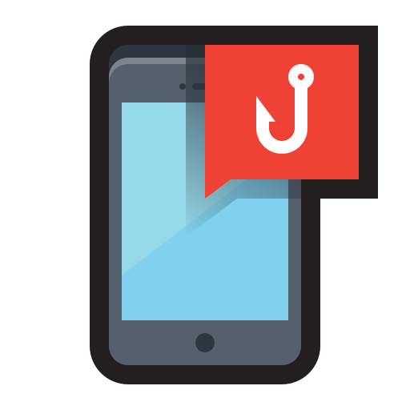

{ align=right width=150 }
Smishing (SMS phishing) is a cyber attack that tricks users into revealing sensitive information or clicking malicious 
links via fraudulent text messages. These attacks often impersonate trusted entities, such as banks, delivery services, or government agencies.

---

### Steps to Recover from a Smishing Attack

If you suspect you’ve fallen victim to a smishing attack, follow these steps to mitigate damage:

#### Step 1: Identify the Compromise
- Determine if you have shared sensitive information, such as passwords or financial data.
- Review the suspicious message to assess its intent and potential impact.

#### Step 2: Contain the Threat
- Change any compromised passwords immediately and enable Multi-Factor Authentication (MFA).
- Contact your bank or credit card provider if financial details were disclosed.
- Block the sender’s number to prevent further contact.

#### Step 3: Notify Relevant Parties
- Report the smishing attack to your organization’s IT or security team.
- Inform friends, family, or colleagues if they might also be at risk due to shared contacts.

#### Step 4: Scan for Malware
- Check your device for malicious apps or malware installed via smishing links.
- Use a trusted mobile security application to scan and remove threats.

#### Step 5: Report the Incident
- Forward the smishing message to your mobile carrier’s spam reporting service (e.g., 7726 in the UK).
- Report the attack to relevant authorities, such as Action Fraud in the UK.

#### Step 6: Educate Yourself and Others
- Learn how to recognize smishing attempts by reviewing common tactics.
- Share your experience to raise awareness and prevent similar incidents.

#### Step 7: Review and Update Security Measures
- Ensure that all apps and operating systems on your device are up to date.
- Implement security tools, such as mobile threat detection software, to enhance protection.

---

### How to Prevent Smishing Attacks

Preventing smishing attacks requires awareness and proactive security measures. Follow these best practices to stay protected:

#### Be Cautious with Text Messages
- Avoid clicking on links in unsolicited or unexpected messages.
- Verify the sender’s identity before responding to requests for sensitive information.

#### Use Mobile Security Software
- Install reputable mobile security apps to detect and block malicious links or apps.
- Enable SMS filtering features to reduce spam messages.

#### Educate Employees and Users
- Conduct training sessions to help users identify and respond to smishing attempts.
- Share examples of common smishing tactics, such as fake delivery notifications or urgent account alerts.

#### Protect Sensitive Information
- Do not share personal or financial information via text messages.
- Use secure apps or official websites for transactions requiring sensitive data.

#### Enable Two-Factor Authentication (2FA)
- Require 2FA for all critical accounts to enhance security.
- Use authentication apps instead of SMS-based 2FA to minimize risk.

#### Regularly Update Devices
- Keep your smartphone’s operating system and apps updated to patch vulnerabilities.
- Disable unnecessary features, such as Bluetooth, to reduce attack surfaces.

#### Monitor and Report Suspicious Activity
- Regularly check your mobile account for unusual activity or charges.
- Report suspicious messages to your mobile carrier and relevant authorities.

#### Develop a Smishing Response Plan
- Create an incident response plan specifically for smishing attacks.
- Ensure that all team members understand how to report and manage such incidents.
---a
By implementing these strategies, you can significantly reduce the likelihood of falling victim to smishing attacks and better protect sensitive information.
