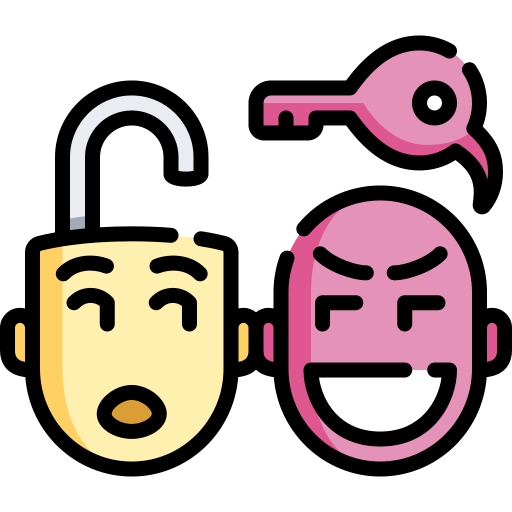

{ align=right width=150 }

Social Engineering is a type of cyberattack that relies on psychological manipulation rather than technical hacking. Instead of breaking into systems, attackers trick people into giving up confidential information, such as passwords, financial details, or access to sensitive systems. 

---
#### Common Social Engineering Tactics

1. Phishing – Fraudulent emails, messages, or websites designed to steal credentials or sensitive data.
2. Pretexting – Attackers create a fabricated scenario to trick victims into providing information.
3. Baiting – Offers of free software, media, or services that contain malware.
4. Tailgating/Piggybacking – Gaining physical access to restricted areas by following authorized personnel.
5. Vishing (Voice Phishing) – Using phone calls to impersonate trusted entities and extract information.
6. Quid Pro Quo – Offering something valuable in exchange for sensitive information.
7. Impersonation – Pretending to be a legitimate individual to gain trust and exploit targets.

---

### Examples of Social Engineering Attacks

#### Example 1: Phishing Email
A user receives an email appearing to be from their bank, asking them to verify their account by clicking a link. The link leads to a fake website designed to steal login credentials.

#### Example 2: CEO Fraud
An attacker impersonates a company executive and sends an urgent email to the finance department, requesting a wire transfer to a fraudulent account.

#### Example 3: Baiting with USB Drives
An attacker leaves infected USB drives labeled "Confidential Reports" in public places. When inserted, the device installs malware on the victim's system.

#### Example 4: Tech Support Scam
A fraudster calls an employee claiming to be IT support, requesting login credentials to "fix" a non-existent problem.

#### Example 5: Tailgating
An attacker follows an employee into a secured office building by pretending to have forgotten their access badge.

---

### Mitigating the Risk of Social Engineering Attacks

#### 1. Educate and Train Employees
- Conduct regular training sessions on recognizing and avoiding social engineering tactics.
- Simulate phishing attacks to test employee awareness.

#### 2. Verify Requests for Sensitive Information
- Encourage employees to verify any unusual requests through official channels.
- Never share sensitive information over email or phone without confirmation.

#### 3. Strengthen Authentication Methods
- Implement Multi-Factor Authentication (MFA) for all critical accounts.
- Use biometric or hardware-based authentication for added security.

#### 4. Implement Email and Network Security
- Deploy email filtering to detect phishing attempts and suspicious attachments.
- Monitor network activity for unusual access patterns.

#### 5. Establish a Security Culture
- Encourage employees to report suspicious interactions or security concerns.
- Reinforce a mindset of "trust but verify" for all communications.

#### 6. Secure Physical Access
- Use ID badges and strict access control measures to prevent tailgating.
- Ensure security personnel are trained to detect impersonation attempts.

#### 7. Monitor and Respond to Threats
- Utilize Security Information and Event Management (SIEM) tools to detect suspicious behavior.
- Conduct regular security audits to identify potential vulnerabilities.

#### 8. Develop an Incident Response Plan
- Establish protocols for reporting and responding to social engineering attacks.
- Assign roles for handling security breaches and employee awareness initiatives.

By following these best practices, organizations can significantly reduce the risk of falling victim to social engineering attacks and protect sensitive information from manipulation.
