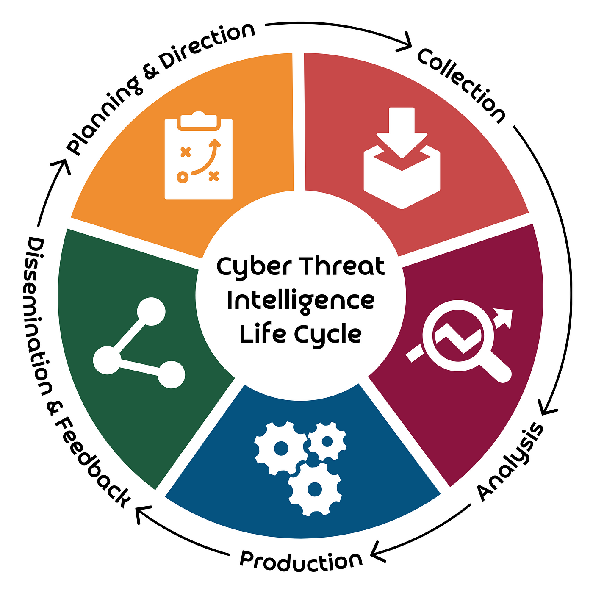

# Understanding Cyber Threat Intelligence

{ align=right width=240 }

The field of Cyber Threat Intelligence (CTI) is vast and constantly evolving. Expecting platform users to fully master every aspect would be neither realistic nor practical. However, this section provides a concise overview of CTI, covering key concepts, essential industry terminology, and additional reference materials.

This information serves as a reference to help users better understand, investigate, and report cyber attacks. While not exhaustive, it offers a foundational understanding that can improve situational awareness and threat analysis capabilities.

---