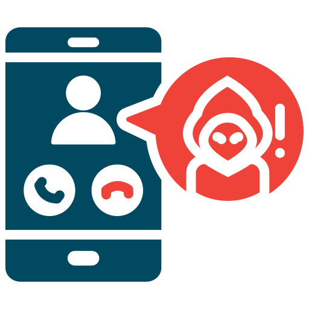

{ align=right width=150 }

Vishing (voice phishing) is a social engineering attack where scammers use phone calls to deceive individuals into divulging sensitive information, such as financial details or login credentials.

---

### Recover from a Vishing Attack

 Follow these steps to recover from such an attack:

#### Step 1: Identify the Compromise
- Determine what information was shared during the call, such as passwords, banking details, or personal information.
- Check for any unauthorized transactions, account changes, or suspicious activities.

#### Step 2: Secure Compromised Accounts
- Immediately change passwords for any affected accounts.
- Enable multi-factor authentication (MFA) to add an extra layer of security.
- Contact your bank or service provider to report potential fraud.

#### Step 3: Report the Incident
- Notify your IT or security team if company accounts were involved.
- Report the scam to local authorities or cybersecurity agencies, such as Action Fraud (UK) or the FTC (US).
- Inform your financial institution or credit agency if banking details were compromised.

#### Step 4: Monitor for Fraudulent Activity
- Regularly review account statements and transactions for unauthorized activities.
- Set up alerts for login attempts, changes in account settings, or financial transactions.
- Request a credit freeze or fraud alert if sensitive financial data was disclosed.

#### Step 5: Educate and Inform
- Share details of the attack with colleagues, friends, or family to prevent further incidents.
- Provide training on recognizing and avoiding vishing scams.

#### Step 6: Review Security Measures
- Update security policies to include guidelines on handling unsolicited calls.
- Implement call verification protocols within your organization to confirm identity before sharing information.

---

### Mitigate the Risk of Vishing Attacks

Preventing vishing attacks requires a mix of awareness, verification procedures, and secure communication practices. Follow these best practices:

#### Verify Caller Identity
- Always verify the caller's identity before sharing sensitive information.
- Call back using an official number from a trusted source rather than the one provided by the caller.

#### Use Call Authentication Tools
- Enable caller ID verification and spam detection on your phone.
- Use services like STIR/SHAKEN to detect spoofed phone numbers.

#### Limit Information Disclosure
- Avoid sharing personal, financial, or login details over the phone unless absolutely necessary.
- If a caller claims to be from a bank or organization, verify through official channels.

#### Educate Employees and Users
- Conduct training sessions on recognizing vishing scams and social engineering tactics.
- Simulate vishing attacks to assess awareness and preparedness.

#### Monitor and Report Suspicious Calls
- Encourage employees and users to report suspicious calls.
- Maintain a record of fraudulent phone numbers and share them with security teams.

#### Implement Security Policies
- Establish clear policies on handling sensitive data over phone calls.
- Require multi-step verification for transactions or sensitive account changes.

#### Develop an Incident Response Plan
- Create a clear plan for responding to vishing attacks, including reporting procedures and recovery steps.
- Assign roles to ensure a quick and effective response.

By implementing these measures, you can significantly reduce the risk of vishing attacks and protect sensitive information from fraudulent callers.